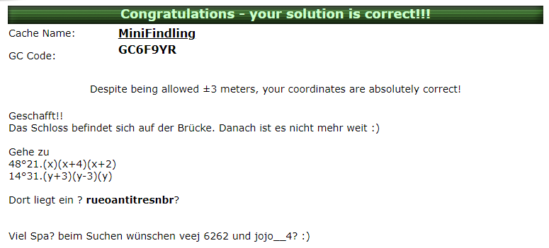

# Exersice 1

## 1.1

### Answer

-   Key: XIQVNALDEKWFOURHTPCBMGYS
-   Text: MOREOVER, THE RELATION'S CONTENTUAL INFORMATION MAY REVEAL VERY HIGH SENSITIVITY TO ALTERATIONS IN GENERAL. SOME EXTREME EXAMPLES OF SUCH DATA POOLS INCLUDE MEDICAL, MILITARY AND RESEARCH DATABASES: THOSE MAY CONTAIN INFORMATION WHICH REQUIRES UTTERLY PRECISE ACCURACY AND WON’T BE USEFUL OTHERWISE. EVEN WORSE, ONE MAY THINK OF SCENARIOS WHICH WILL NOT ONLY MAKE THE DATA IN QUESTION USELESS FOR ITS ORIGINAL INTENT, BUT MAY SERIOUSLY CORRUPT CORPORATIONS, RESEARCH RESULTS OR IN EXTREME CASES, EVEN PEOPLE. IN ADDITION, THERE ARE COUNTLESS HIGH-LEVEL DATA TYPES WHICH DO NOT TOLERATE EVEN SLIGHT MODIFICATIONS TO THE DATA THEY WERE DEVELOPED TO CONTAIN AND ACCUMULATE. EXAMPLES OF SUCH DATA TYPES INCLUDE EARTH COORDINATE FRAME DATA TYPES LIKE THE WORLD GEODETIC SYSTEM (THE LATEST BEING WGS84), PHARMACEUTICAL INDICATION OF CHEMICAL QUANTITIES, OR MONETARY DATA REFERRING TO THE GLOBAL BANKING SYSTEM.

### Guide

1. I started with a frequenzy analysis and the code for that is in `cryptoanalysis.rs` inside `MonoAlphabeticDecrypter::analyze`
2. I found that "RPI" is repeated a lot is the letters were also in the top 5 most accuring character. So I replaced it with "the", because it's the most common word in english texts.
3. In the decrypt code I replaced every character I didn't know the key for with an underscore to distinguish them.
4. After that I looked for other articles.
5. Than for two letter words.
6. From there some words began clear and I repeated the process until I found all letters.

To see it in action run:

```sh
cargo run -- cryptoanalysis
```

## 1.2

### How to run

If you don't have rust go to: https://www.rust-lang.org/tools/install and download the toolchain (it's extremly easy).

Than just run the programm by typing:

```sh
cargo run -- playfair -k PASSWORD -e 'SECURE MESSAGE'
```

Source File: `playfair.rs`.

## 1.3

### Answer

-   Key: 4
-   Text: FINDE DAS SCHLOSS BEI VIER ACHT ZWEI EINS DREI NEUN NEUN UND EINS VIER DREI EINS SECHS EINS SECHS



### Steps

From the hint on the webpage it looked like it was ROT-13 but it didn't work the other alghorithm that used a similar rotation is rail fance and it worked.

To see it in action run:

```sh
cargo run -- geocaching
```

Source File: `geocaching.rs`.

## 1.4

### Cryptanalytic Approach

To Approach this problem without any of the original text we would have to use a techique knwon crib-dragging.
You xor both texts and than try to xor a frequently used word with each part of the encrypted one by one.

Source: https://samwho.dev/blog/toying-with-cryptography-crib-dragging/

### My version

To see it in action run:

```sh
cargo run -- one-time-pad cribdrag
```

For the version that worked to encode both texts run:

```sh
cargo run -- one-time-pad subtraction
```

Source File: `one_time_pad.rs`.

### Decoded Text 1

The source code for Android is open source and it is developed in private by Google, with the source code released publicly when a new version of Android is released. Google publishes most of the code including network and telephony stacks under the non-copyleft Apache License version two, which allows modification and redistribution. the license does not grant rights to the Android trademark, so device manufacturers and wireless carriers have to license it from Google under individual contracts.

Source: https://en.wikipedia.org/wiki/Android_(operating_system)#Licensing

### Decoded Text 2

SELinux is a mandatory access control mechanism for the Linux kernel, implemented as a Linux security module. The Linux Security Modules (LSM) framework allows third-party access control mechanisms to be linked into the kernel and to modify the default DAC implementation. LSM is implemented as a series of security function hooks (upcalls) and related data structures that are integrated into the various modules of the Linux kernel responsible for access control.

Source: https://guide.aosp.ir/fa/latest/references/books/Android_Security_Internals.pdf

## Bonus

Souce Code: enimga directory

```sh
cargo run -- enigma -init '3:22:15' -plug 'A:H,D:P,X:Y' 'Hallo World'
```
